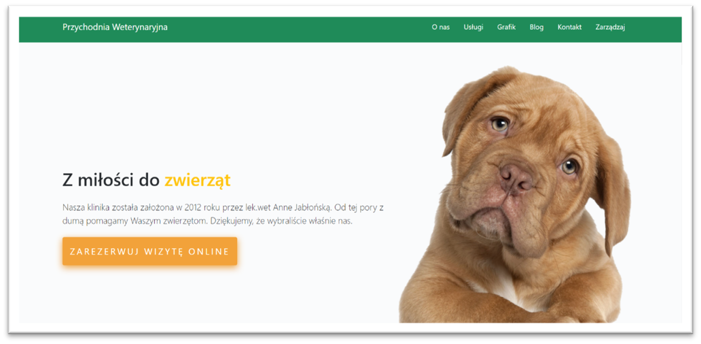
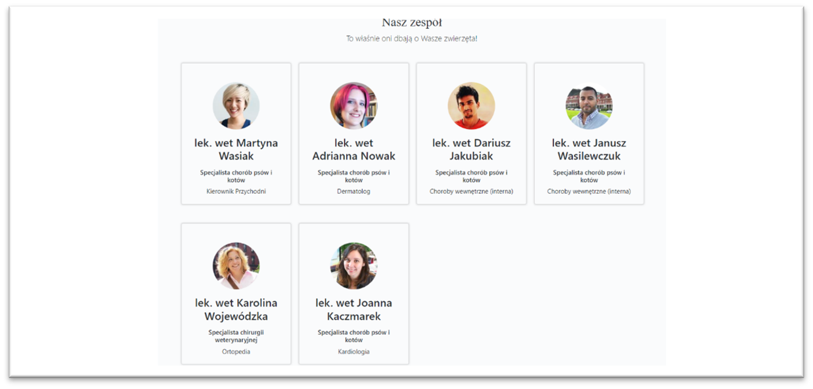
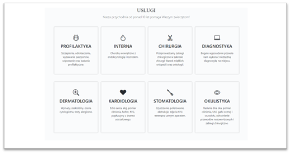
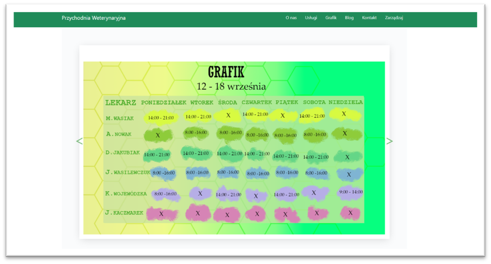
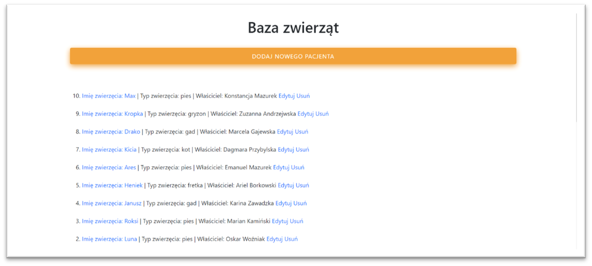
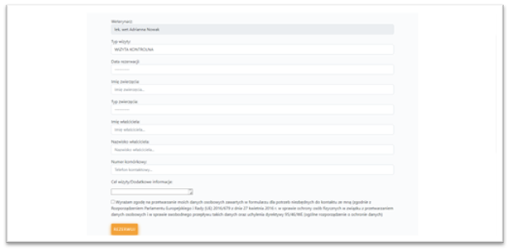
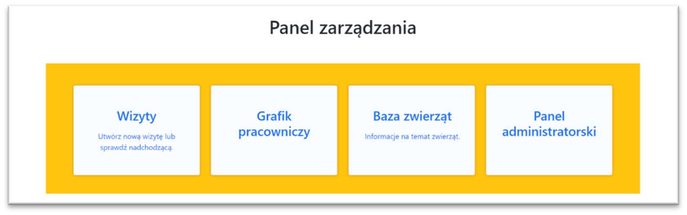

# 🐾 Vet Clinic App – Fullstack Web Application for Veterinary Clinic Management

**Vet Clinic App** is a full-featured web application built from scratch as a Fullstack Developer project.  
It helps veterinary clinics manage animal records, employee schedules, services, and appointment bookings — all in one place.

---

## 🔧 Technologies Used

- **Backend:** Python, Django, Django ORM  
- **Database:** PostgreSQL  
- **Frontend:** HTML, CSS, JavaScript, Bootstrap (CDN Icons)  
- **Rich Text Editor:** CKEditor5  
- **Image Processing:** Pillow  
- **APIs:** RandomUserGeneratorAPI for sample data  
- **Graphics:** GIMP  

---

## ✨ Features

### 🐕 Animal and Client Management
- Register and manage animal records  
- View animal details with images  

### 👩‍⚕️ Employee and Schedule Management
- Add/edit employee data  
- Manage and display work schedules  

### 🛠 Services and Appointments
- List and categorize veterinary services  
- Book and manage appointments through an interactive form  

### 📝 Blog and Content Management
- Create and edit blog posts with CKEditor5 rich text editor  
- Manage content easily through Django admin  

---

## 🗂 App Structure

| Folder / App       | Description                                   |
|-------------------|-----------------------------------------------|
| `app/`            | Main Django app with models, views, forms, templates, static files |
| `media/`          | Uploaded user files and animal photos          |
| `mysite/`         | Project configuration (settings, URLs, WSGI)  |
| `requirements.txt`| Python dependencies                            |
| `manage.py`       | Django management script                       |

---

## 📸 Screenshots

| View                      | Screenshot Path                    |
|---------------------------|----------------------------------|
| Homepage                  |        |
| Employee List             |        |
| Services Overview         |         |
| Work Schedule             |         |
| Animal Database           |          |
| Appointment Booking Form  | |
| Admin Panel               |      |

---

Jasne, oczywiście. Dodałem te informacje w nowej sekcji na końcu i lekko zmodyfikowałem istniejące kroki, aby wszystko było spójne.

Oto ostateczna, kompletna wersja pliku `README.md` w języku angielskim. Wystarczy, że skopiujesz i wkleisz całość na swój GitHub.

-----

-----

# Veterinary Clinic App - Setup Instructions

A simple web application built with Django that simulates an appointment booking system for a veterinary clinic.

-----

## \#\# Prerequisites

Before you begin, ensure you have the following software installed on your system:

  * **Python** (version 3.10+ recommended)
  * **Git**
  * **PostgreSQL** (database server)

-----

## \#\# Step-by-Step Installation

This guide will walk you through the entire process of configuring and running the project.

### **1. Clone the Repository**

Open your terminal or command prompt, clone the repository to your local machine, and navigate into the project directory.

```bash
git clone https://github.com/karinazz/Vet-Clinic-App.git
cd Vet-Clinic-App
```

### **2. Prepare the `requirements.txt` File**

The original dependency file may contain packages incompatible with newer Python versions. To avoid compilation errors, **replace the entire content** of the `requirements.txt` file with the following:

```
Django>=4.0,<5.0
django-ckeditor>=6.7.0
Pillow>=9.5.0
psycopg2-binary>=2.9.5
```

### **3. Virtual Environment and Dependency Installation**

We will create an isolated Python environment and install all required libraries into it.

```bash
# Create a virtual environment
python -m venv venv

# Activate the virtual environment
# On Windows:
venv\Scripts\activate
# On macOS/Linux:
# source venv/bin/activate

# Install the packages from the modified requirements file
pip install -r requirements.txt
```

### **4. PostgreSQL Database Configuration**

The project includes a database dump file (`vetdb.sql`) that needs to be restored to your PostgreSQL server.

#### **4.1. Create an Empty Database**

Open **pgAdmin**, connect to your database server, and create a new, **empty** database named exactly **`vetdb`**. If a database with this name already exists, it's best to delete (Drop) it and create it again to ensure it's empty.

#### **4.2. Restore the Database from `vetdb.sql`**

Next, we will load the schema and data from the `vetdb.sql` file into the newly created database.

1.  Open a **new Command Prompt (cmd)** on Windows (not the one where your `venv` is active).
2.  Use the following command, replacing `path\to\your\file` with the **full, absolute path** to the `vetdb.sql` file on your computer:
    ```bash
    psql -U postgres -d vetdb -f "path\to\your\file\vetdb.sql"
    ```
    *Example:* `psql -U postgres -d vetdb -f "C:\Users\YourName\Downloads\Vet-Clinic-App\vetdb.sql"`
3.  Enter the password for the `postgres` user when prompted.

> **Important:** If you get an error like `'psql' is not recognized...`, you need to first navigate to the PostgreSQL installation directory. Run `cd "C:\Program Files\PostgreSQL\16\bin"` (adjust `16` to your version), and then run the `psql` command again from there.

### **5. Configure the `settings.py` File**

You need to connect the Django application to your database and set a security key.

1.  Open the file `mysite/settings.py`.
2.  Find the `DATABASES` section and fill in your credentials (especially the password):
    ```python
    DATABASES = {
        'default': {
            'ENGINE': 'django.db.backends.postgresql',
            'NAME': 'vetdb',
            'USER': 'postgres',
            'PASSWORD': 'YourPostgreSQLPassword', # <-- ENTER YOUR PASSWORD HERE
            'HOST': '127.0.0.1',
            'PORT': '5432',
        }
    }
    ```
3.  In the same file, locate the `SECRET_KEY` setting and ensure it is not empty. For development purposes, any string will work.
    ```python
    SECRET_KEY = 'any-random-string-for-development-purposes'
    ```

### **6. Final Setup**

You're on the final stretch\!

1.  **Migrations**
    Since we restored the database from a file, the tables already exist. We just need to sync Django's migration state.

    ```bash
    python manage.py migrate
    ```

    > If you see errors stating that relations (tables) already exist, run the command with the `--fake` flag: `python manage.py migrate --fake`.

2.  **Create a Superuser (Optional)**
    This command allows you to create your own administrator account to access the `/admin` panel.

    ```bash
    python manage.py createsuperuser
    ```

    > **Note:** The restored database already contains pre-made accounts (see Usage section below). This step is only if you want to create an additional, separate admin user.

3.  **Run the Server**
    Start the development server.

    ```bash
    python manage.py runserver
    ```

-----

## \#\# Usage

Once the server is running, you can access the application.

  * **Clinic Website URL:** `http://127.0.0.1:8000/`
  * **Admin Panel URL:** `http://127.0.0.1:8000/admin`

### **Login Credentials**

The provided database (`vetdb.sql`) includes pre-loaded user accounts. You can use the following credentials to log in:

#### **Admin Account (Superuser):**

  * **Username:** `admin`
  * **Password:** `Przychodnia%1`

#### **Staff Account (Employee):**

  * **Username:** `ANowak`
  * **Password:** `Przychodnia%2`
    ```

You're all set\! 🎉 The application is now available in your browser at **`http://127.0.0.1:8000/`**. The admin panel is located at **`/admin`**.
